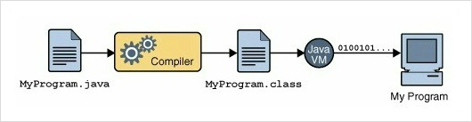

# .js 에 대한 질문

1. **왜 js임?**
2. **next.js같은 프레임워크들은 누가 돌리는지**

## 1. 왜 js임? - 답변

요즘 대세는 크래스 플랫폼 or 웹 사용.

**웹** : 어떤 기기에서든지 돌아감. 인터넷만 되면 유비-콰타스

- js 리빙포인트: js, python, java 를 많이 씀 (c계열 애들도 쓰긴 씀)
- js : 웹때문에 java: java로 만들어진 애들 때문에 python: 오픈소스 / 특히 블록체인에서

### js

1. 웹
2. 단순 웹 브라우저에서 동작이 끝나지 않음 *ex) 노드.js

킹반인들이 프로그램을 다운+인스톨해야하는데, js를 통하면 다운+인스톨+호환성 고려를 최소화할 수 있음.

## 2. 그래서 .js는 누가 돌림?

**프레임워크**를 돌린다? 프레임워크는 라이브러리와 비슷한 역할. 돌린다기보다 임포트.
프레임워크에 있는 여러 프로그램을 누가 돌리냐? 가 핵심. *주로CPU가 일함*

***C언어는 어떻게, 누가 돌리나?***

- Code blocks나 Dev C++ 같은 프로그램들은 C언어를 작성하기위해 도와주고, 컴파일을 쉽게 해주는 역할
- 실질적으로는 컴파일 된 프로그램이 '돌아가는 것'
- 터미널(cmd)을 통해서도 C를 작성하고, 컴파일할 수 있다.(아마?)

## VM (Virtual Machine)

java를 돌려야할 때 VM이 돌려줌.

VM이 있음으로써 어느 컴퓨터에서든지 돌아가게끔 함.

VM이 징검다리.

## JAVA의 구동원리

1. 소스코드를 작성한다. (.java 확장자의 소스 파일)
2. 컴파일러(javac.exe)가 바이트코드로 변환한다. (.class 확장자의 클래스 파일)
3. 런처(java.exe)로 자바 가상 머신을 구동시킨다.
4. 자바 가상 머신이 바이트코드를 해석하여 자바 프로그램이 실행된다.

## 그럼 js는?

java와 js는 완전 다르기 때문에, java와는 완전 다른 방식으로 구동됨.

하지만 프레임웤들을 돌려주는 중간단계 VM이 있다.

### ex) 프레임워크 React

js로 만든 프렘웤. 라이브러리를 돌리는 게 아니기 때문에, React를 돌린다는 말은 어폐가 있음.